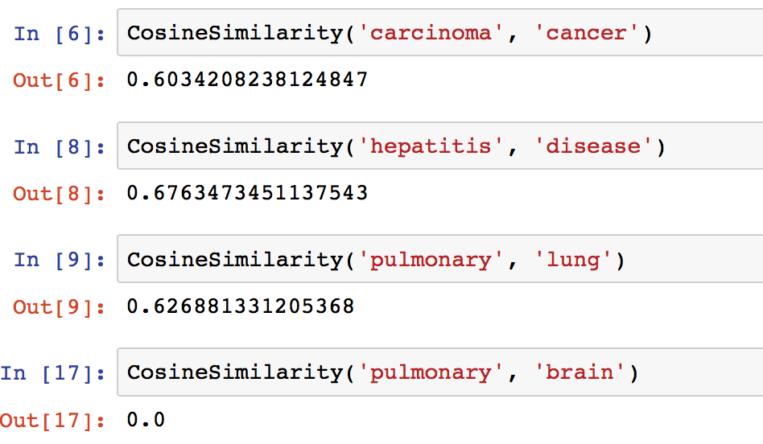
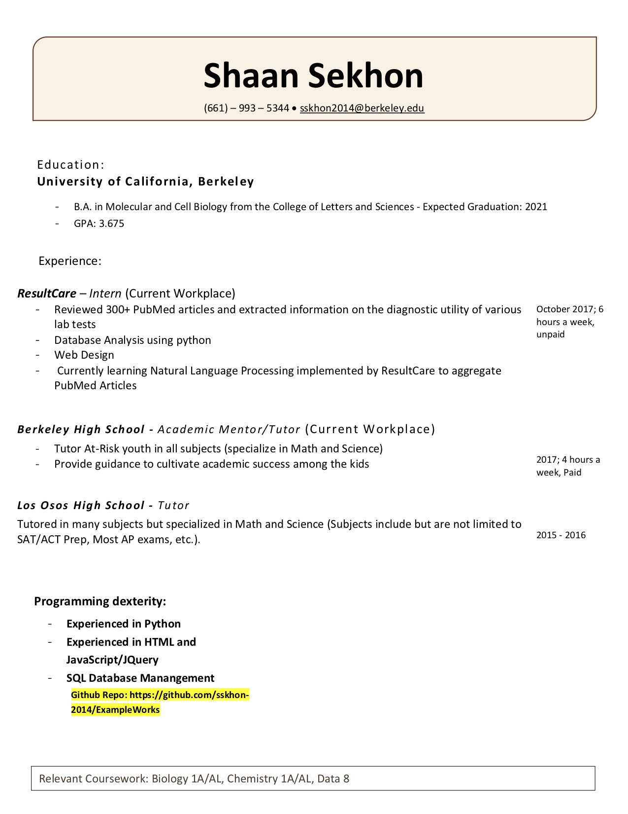

# ExampleWorks
Here is an example of some of my work. Please take some time to look around!

# CosineSimilarityAlgorithm.ipynb
This is a cosine similarity algorithm I designed. It uses gensim's word2vec model trained on text8, 10^9 bytes of the English Wikipedia. Through repetition and the use of thresholds, this algorithm can effectively calculate the percent similarity between documents. The only downside of this algorithm is, however, that it does not efficiently compute the percent similarity in large documents. This algorithm was used to convert the local diagnoses in ResultCare's database to the universal standard ICD9. This is a novel approach to Natural Language Processing and it essentially implents a highly complex word search. Wheras a normal word search looks at bits of letters present in different documents, this algorithm takes almost any word in the english language and computes the percent similarity between that word and its closest neighbors. After creating such a model, we can enter in any two sentences as arguements and get the percent similarity between them. 

You can see the output of this algorithm below:

  
  

  
# ResultCare's Data Entry Website 
I have also included the html code of the landing page of the data entry platform I designed for ResultCare. This was used to manually enter data from PubMed into the ResultCare database. You can visit the website at: http://distracted-hodgkin-a22e8d.bitballoon.com.
There is also an accompanying javascript file called validation-functions.js. This script submits data from the website as AJAX requests to google sheets. This website is completely functional so please do not submit any information here. 

# My Résumé

  
  

# Acknowledgments
- Deok Gun Park, conceptvector, Hedonmeter vs Word2vec Cosine Similarity.ipynb (2016), https://github.com/intuinno/conceptvector/blob/master/experiment/Hedonmeter%20vs%20Word2vec%20Cosine%20Similarity.ipynb

- Martin Hawksey (2014), https://mashe.hawksey.info/2014/07/google-sheets-as-a-database-insert-with-apps-script-using-postget-methods-with-ajax-example/
